# Assignment 1 - Image Warping

本次实验需要实现图像变形：包括以下两个部分：

1.全局的图像变形：包括平移、旋转、缩放，翻转。

2.基于控制点的图像变形：本次实验实现了基于MLS的仿射变换、相似变换、刚性变换，以及基于RBF基函数插值的图像变形，还有IDW图像变形。

## 环境配置
本次实验使用解释器python3.10，以及库opencv-python 4.10.0.84, numpy 1.26.4, gradio 3.36.1
```setup
python -m pip install -r requirements.txt
```
## 程序运行与使用
运行全局图像变形：
```basic
python run_global_transform.py
```
运行基于控制点的图像变形：
```point
python run_point_transform.py
```
---
## 一、 全局的图像变形
全局图像变形需要填充代码框架中的 [缺失部分](run_global_transform.py#L21)   'run_global_transform.py'。

在这个部分，需要实现平移、旋转、缩放，翻转等基本的图像变形操作。这里只需要利用opencv的warpAffine函数和flip函数即可完成对图像的变形操作而无需自己考虑图像边界等问题。

具体来说，需要构建出仿射变形矩阵(3x3)并将它们复合：
### 1.缩放：
$$
\begin{pmatrix}
scale & 0 & (1-scale)*width/2 \\
0 & scale & (1-scale)*height/2 \\
0 & 0 & 1
\end{pmatrix}
$$
```python
 scale_matrix = np.array([[scale, 0, (1-scale)*width/2], [0, scale, (1-scale)*height/2]], dtype=np.float32)
 scale_matrix = to_3x3(scale_matrix)
```
### 2.平移：
$$
\begin{pmatrix}
1 & 0 & translation\_x \\
0 & 1 & translation\_y \\
0 & 0 & 1
\end{pmatrix}
$$
```python
translation_matrix = np.array([[1, 0, translation_x], [0, 1, translation_y]], dtype=np.float32)
translation_matrix = to_3x3(translation_matrix)
```
### 3.旋转：
注意这里是角度制。
$$
\begin{pmatrix}
cos(\theta) & -sin(\theta) & (1-cos(\theta)+sin(\theta))*width/2 \\
sin(\theta) & cos(\theta) & (1-cos(\theta)-sin(\theta))*height/2 \\
0 & 0 & 1
\end{pmatrix}$$
```python
theta = np.radians(rotation)
rotation_matrix = np.array([[np.cos(theta), -np.sin(theta), (1-np.cos(theta)+np.sin(theta))*width/2], [np.sin(theta), np.cos(theta), (1-np.cos(theta)-np.sin(theta))*height/2]], dtype=np.float32)
rotation_matrix = to_3x3(rotation_matrix)
```
### 4.矩阵复合并用warpAffine函数实现变形：
```python
compound_matrix = translation_matrix @ scale_matrix @ rotation_matrix
compound_matrix_2x3 = compound_matrix[:2, :]
transformed_image = cv2.warpAffine(image, compound_matrix_2x3, (width, height), borderValue=(255, 255, 255))
```
### 5.翻转：
这里只需要调用opencv的flip函数即可。
```python
if flip_horizontal:
    transformed_image = cv2.flip(transformed_image, 1)
```

### 6.效果展示：
<center>
<figure>
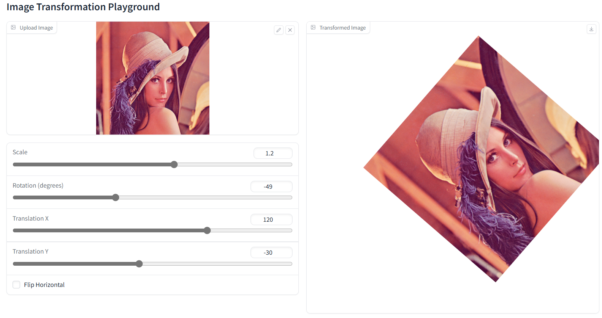
</figure>
</center>

---
## 二、 基于控制点的图像变形
基于控制点的图像变形需要填充代码框架中的 [缺失部分](run_point_transform.py#L52)   'run_point_transform.py'。

在这个部分，需要实现基于MLS的仿射变换、相似变换、刚性变换，以及基于RBF基函数插值的图像变形，还有IDW图像变形。

对于这五种变形方法，基本思路都是利用opencv的remap函数，通过计算出每个像素点的变换后的位置，然后通过其自带的双线性插值得到变换后的像素值。

**这里有一些值得讨论的问题：**

1.如果直接利用for循环来计算，效率会极低，因此需要利用能处理高维矩阵运算的numpy库来加速计算。一次性直接算出所有像素点的变换后的位置。

2.如果直接对每个点应用变形函数将会出现一个问题：由于变形函数是连续函数且一般情况下不是一个满射，因此变形后的图像中会有很多空洞和“黑线”，
这一点图形学中也有提及，计算机图形学课程中给出的解决办法是利用最近邻点查询或者对邻近点做平均来消除这些空洞，这里opencv的remap函数提供了插值方法，
我们将参数设为cv2.INTER_LINEAR即可。

3.opencv的remap函数逻辑是给定两个映射矩阵，大小与原图像相同，然后新的图像对应像素在原图像中的位置从映射矩阵中获取。
按照这个逻辑，我们最后会发现得到的结果是“反过来的”，即控制点与目标点对调了。为了解决这个问题，我们反向考虑：\
原图像经过对应点控制的变换($p_i \rightarrow q_i$)得到新图像，新图像通过反向的变换($q_i\rightarrow p_i$)应该也能得到原图像。
因此为了利用remap函数实现最终的效果，只需要将source point与target point对调一下即可。

基于上述考虑，最终的实现方法与结果展示如下：
### 0. 原始图像展示
<center>
<figure>


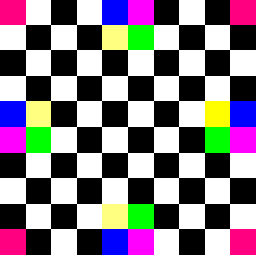
</figure>
</center>

### 1.基于MLS的仿射变换
$$f_{a}\left( v\right) =\left( v-p_{\ast }\right) \left( \sum _{i}\widehat{p_i}^{T}\omega_{i}\widehat{p}_{i}\right)^{-1}
\sum _{j}\widehat{p_{j}}^{T}\omega_j\widehat{q}_{j}+q_{\ast }$$
$$p_{\ast }=\dfrac{\sum _{i}w_{i}p_{i}}{\sum _{i}w_{i}}
	,q_{\ast }=\dfrac{\sum _{i}w_{i}q_{i}}{\sum _{i}w_{i}}$$
$$\widehat{p}_{i}=p_i-p_{\ast},\widehat{q}_{i}=q_i-q_{\ast},\omega_i=\frac{1}{|p_i-v|^{2\alpha}}$$

<center>
<figure>
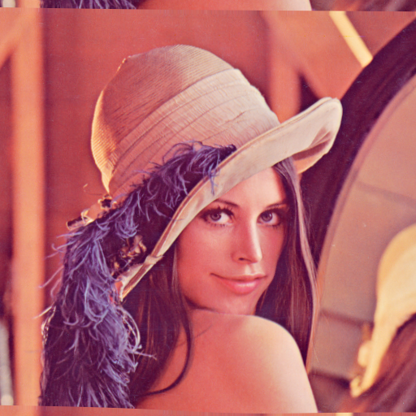
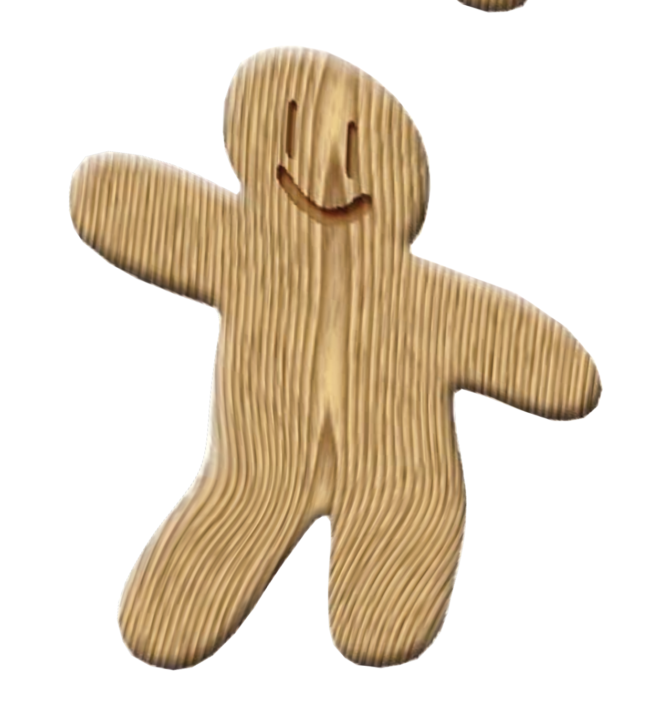
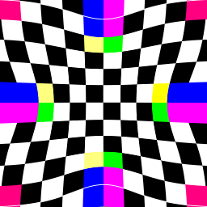
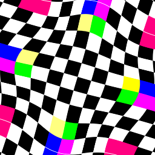
</figure>
</center>

### 2.基于MLS的相似变换
$$f_{s}\left( v\right) =\sum _{i}\widehat{q}_{i}\left( \dfrac{1}{\mu _{s}}A_{i}\right) +q_{\ast }$$
$$\mu _{s}=\sum _{i}w_{i}\widehat{p}_{i}\widehat{p_{i}}^{T},A_{i}=\omega _{i}\begin{pmatrix} \widehat{p}_{i} \\ -\widehat{p}_{i}^{\bot} \end{pmatrix}\begin{pmatrix} v -p_{\ast } \\ -\left( v -p_{\ast }\right)^{\bot} \end{pmatrix}^{T},(x,y)^{\bot}=(-y,x)$$

<center>
<figure>
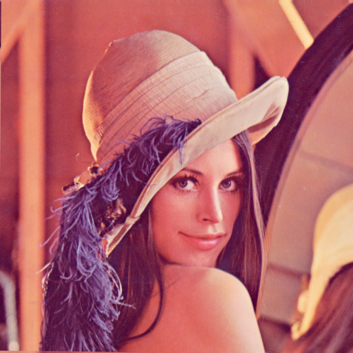
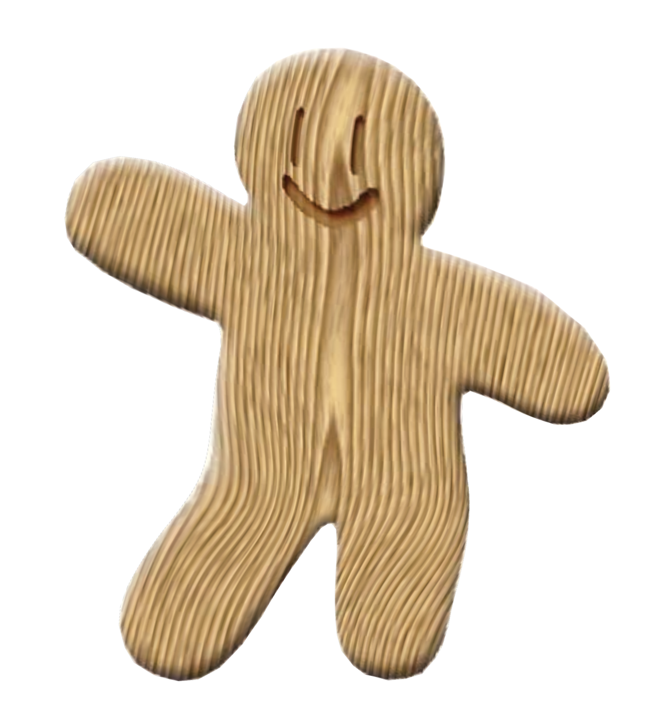
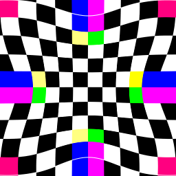
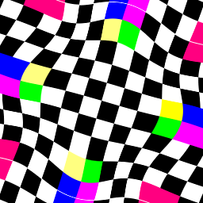
</figure>
</center>

### 3.基于MLS的刚性变换
$$f_{r}\left( v\right) =\left| v-p_{\ast }\right| \dfrac{\overrightarrow{f_r}\left( v\right) }{\left| \overrightarrow{f_r}\left( v\right) \right| }+q_{\ast } $$
$$\overrightarrow{f_r}\left( v\right)=\sum_{i} \widehat{q}_{i}A_i,A_{i}=\omega _{i}\begin{pmatrix} \widehat{p}_{i} \\ -\widehat{p}_{i}^{\bot} \end{pmatrix}\begin{pmatrix} v -p_{\ast } \\ -\left( v -p_{\ast }\right)^{\bot} \end{pmatrix}^{T}$$

<center>
<figure>


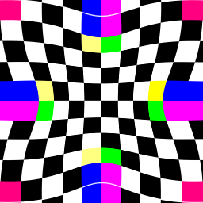
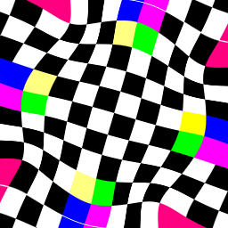
</figure>
</center>

### 4.基于RBF基函数插值的图像变形
RBF算法假设变换的函数是基函数的线性组合形式：
$$f(v) = \sum_{i=1}^{n} \alpha_i R(\Vert v-p_i \Vert) + Av+b$$
其中$R$是RBF基函数，这里选取$R(d)=(d^2+r^2)^{\alpha}$，默认$r=10,\alpha=0.5$。$A\in R^{2\times 2}$和$b \in R^{2}$是仿射变换的参数。

变形函数$f(v)$有$2n+6$个待定系数，$f(p_i)=q_i$只给出了$2n$个约束，为此我们添加以下6个约束：
$$\begin{pmatrix} p_1 & ... & p_n\\ 1 & ... & 1 \end{pmatrix}_{3\times n}
	\begin{pmatrix} {\alpha_1}^{T} \\ ... \\ {\alpha_n}^{T}\end{pmatrix}_{n\times 2}=0_{3\times 2}$$

通过解线性方程组即可得到$f(v)$。

<center>
<figure>
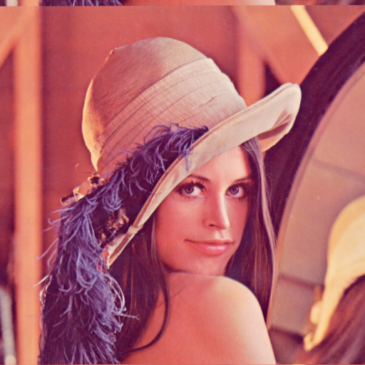

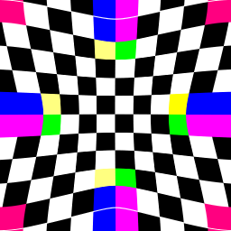
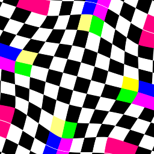
</figure>
</center>

### 5.基于IDW算法(Inverse distance-weighted interpolation methods)的图像变形
IDW算法假设变换函数具有如下加权平均的形式：
$$f(v) = \sum_{i=1}^{n} w_i(v)f_i(v)$$
其中$f_i(v)$为仿射变换$q_i+D_i(p-p_i)$，$w_i(v)$形如$\frac{\sigma_i(v)}{\sum_{j=1}^{n} \sigma_j(v)}$，
这里的$\sigma_i(v)=\frac{1}{\Vert v - p_i\Vert^{\alpha}}$，默认$\alpha=2$。

于是我们需要通过最小化如下能量来得到$D_i$：
$$E_i(D_i) = \sum_{j=1,j\neq i}^{n} \sigma_i(p_j)\Vert q_i+D_i(p_j-p_i)-q_j\Vert^2$$
容易求得：
$$D_i = (\sum_{j=1,j\neq i}^{n} \sigma_i(p_j)p_{j-i}p_{j-i}^T)^{-1} (\sum_{j=1,j\neq i}^{n} \sigma_i(p_j)q_{j-i}p_{j-i}^T)$$ 
$$p_{j-i}=p_j-p_i~~~,~~~q_{j-i}=q_j-q_i$$

<center>
<figure>

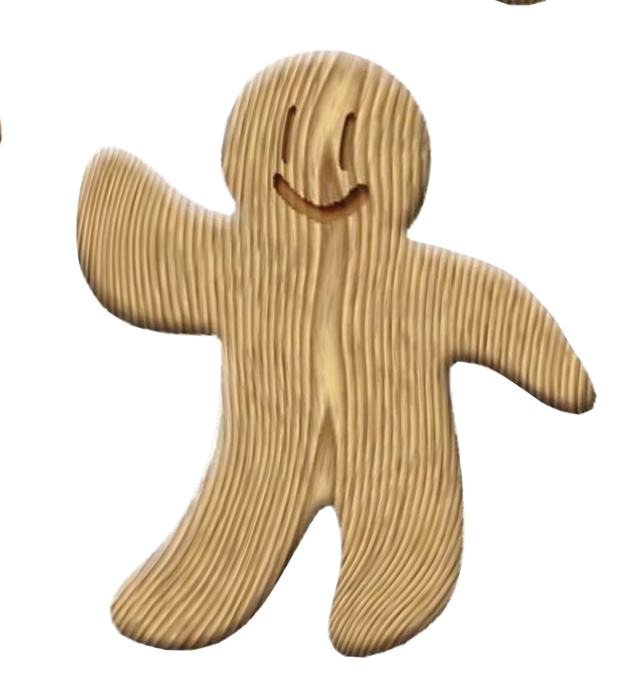
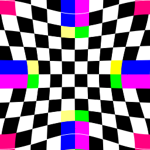
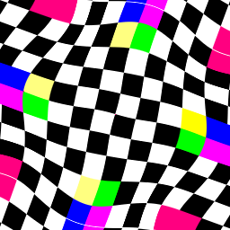
</figure>
</center>

---

## 三、总结
1.图像的全局变换实现起来比较简单，需要注意的是矩阵复合的顺序和变换的中心点，以及不同矩阵的设置。

2.对于基于控制点的图像变形，从结果来看，五种方法都实现了图像的变形。其中在运行时间方面，MLS仿射变换耗时较长，其余四种方法用时都相对较短。

3.从变形效果来看，MLS变形的效果较好，RBF与IDW变形由于参数等选取原因，导致效果略差。

## Reference and Acknowledgement

>📋 Thanks for the algorithms proposed by [Image Deformation Using Moving Least Squares](https://people.engr.tamu.edu/schaefer/research/mls.pdf).
> 
>[Image Warping by Radial Basis Functions](https://www.sci.utah.edu/~gerig/CS6640-F2010/Project3/Arad-1995.pdf). 
> 
> [Image Warping with scattered data interpolation](https://ieeexplore.ieee.org/document/365004).
> 
> [Image Warping using few anchor points and radial functions](https://onlinelibrary.wiley.com/doi/10.1111/1467-8659.1410035).

> 感谢这篇博客提供了实现思路以及numpy相关函数的使用方法：
> [MLS图像变形python实现相关博客](https://www.cnblogs.com/thgpddl/p/14250369.html)

> 其他参考资料：
> 
> 计算机图形学课程(2024)相关作业文档与PPT：[计算机图形学课程(2024)主页](http://staff.ustc.edu.cn/~lgliu/Courses/ComputerGraphics_2024_spring-summer/default.htm)
> 
> Gradio文档：[Gradio官方文档](https://www.gradio.app/docs)
> 
> Numpy文档：[Numpy官方文档](https://numpy.org/doc/stable/)
> 
> opencv教程：[opencv-python教程](https://codec.wang/docs/opencv)


(如有错误欢迎指正， 后续可能会有更新和修改)