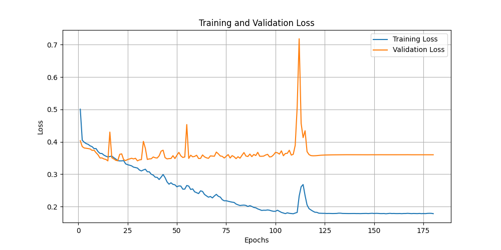
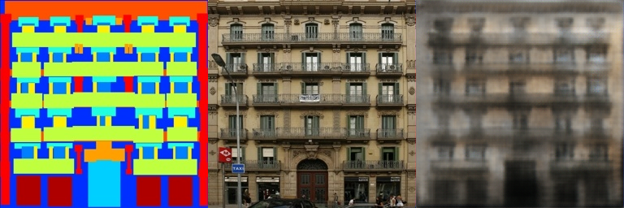
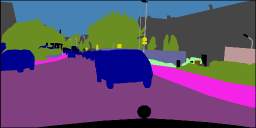

# Assignment 2 - Pix2Pix

本次实验的第二个部分要求用FCN网络实现Pix2Pix。

## 环境配置
本次实验使用解释器python3.10，以及库opencv-python 4.10.0.84, numpy 1.26.4, torch2.4.1, matplotlib3.9.2

## 模型训练
```basic
python train.py
```

## 模型使用
最终的网络参数已训练完成，通过运行test.py可对指定图片进行测试。
```basic
python test.py path/to/your/test_image.jpg path/to/save/output_image.jpg
```
在终端运行该脚本时，需要传入两个参数，分别为输入图片的路径和输出图片的保存路径。
请确保将路径 path/to/your/test_image.jpg 和 path/to/save/output_image.jpg 替换为实际的文件路径。

---
## 网络参数与结构的调整
### FCN-8s
论文中提到的FCN-8s网络(相比其他网络效果更好)，因此采用FCN-8s。

在此网络架构中，第一次卷积将3通道图像变为32通道并将大小缩减为原图像的1/2，随后依次经过4个卷积层得到图像大小分别为原图像的1/4,
1/8,1/16,1/32。再加两个卷积层(相当于CNN中全连接层的作用)得到512通道，大小为1/32的heatmap。

原论文中，直接将heatmap上采样即得到FCN-32s；将heatmap上采样2倍并跳跃连接与1/16大小的图像结合再上采样得到FCN-16s；
将上述与1/16图像结合的结果上采样2倍再与1/8图像结合再上采样得到FCN-8s。理论上还有FCN-4s,FCN-2s,但作者表明FCN-8s效果最好，
增加更多的跳跃连接不会带来提升。


训练参数设置如下：
```python
optimizer = optim.Adam(model.parameters(), lr=0.001, betas=(0.5, 0.999))
scheduler = ReduceLROnPlateau(optimizer, mode='min', factor=0.1, patience=5)
```
网络结构见[FCN_network.py](Pix2Pix/FCN_network.py)。


另外还添加了脚本[plot_loss.py](Pix2Pix/plot_loss.py)用于绘制loss曲线。


可以看到后期出现了较大的波动且验证集误差开始逐渐上升，这种情况可能是过拟合或数据集太小导致的。

模型的训练权重已经保存在Pix2Pix文件夹中，通过test.py可以对给定的图片进行测试。

训练集结果：

验证集结果：

测试结果：


---
为了得到更好的泛化能力，我们可以使用更大的数据集cityscapes来训练网络。还是采用facades类似的处理方法，将原图像和语义图缩小成512x256后拼接到一起。
压缩后图像可能会有所变形，但是占用内存会减少，训练速度也会大大加快。下面是一个训练数据的例子：


**注意：训练两个不同数据集时train.py要做调整，数据集也有一些处理，但是训练的权重已经保存，无需再训练，可以直接利用test.py测试结果。
(注意加载的训练权重是用于facades还是cityscapes)**

训练参数设置：
```python
train_loader = DataLoader(train_dataset, batch_size=200, shuffle=True, num_workers=4)
val_loader = DataLoader(val_dataset, batch_size=200, shuffle=False, num_workers=4)
model = FullyConvNetwork().to(device)
criterion = nn.L1Loss()
optimizer = optim.Adam(model.parameters(), lr=0.005, betas=(0.5, 0.999), weight_decay=1e-4)
scheduler = ReduceLROnPlateau(optimizer, mode='min', factor=0.1, patience=5)
```

训练结果如下：

可以看到40步之后出现了较大波动，验证误差上升，说明出现了过拟合，应该停止训练选择合适的epoch作为结果。




---
## 总结与不足
从网络结构和调整过程来看，主要有以下值得注意的问题：

1.输出层的激活函数选择不当导致训练loss或验证loss不收敛。

2.网络层数及通道数选择不当导致参数过多或过少，出现过拟合或欠拟合的现象。可以适当调整网络结构并引入正则项权重衰减。

3.训练误差或验证误差出现振荡或不下降的情况，需要适当调整batchsize或学习率以平衡振动和收敛缓慢的问题。

不足之处：

本次实验结果与论文结果还是有一定差距，很可能是由于网络结构或参数调整不当导致的偏差，也可能是因为没有使用pytorch自带的resnet,vgg等网络的预训练权重。

最后一点点感悟：本次作业是本人第一次接触pytorch训练神经网络，训练模型调参数是一个费时费力的过程，需要积累很多经验才能少走弯路，
这次作业让我受益匪浅，收获了很多有关机器学习的知识和实践技巧。

## Reference and Acknowledgement
>📋 Thanks for the algorithms proposed by [Paper: Image-to-Image Translation with Conditional Adversarial Nets](https://phillipi.github.io/pix2pix/)
> 
> [Paper: Fully Convolutional Networks for Semantic Segmentation](https://arxiv.org/abs/1411.4038)

> 其他参考资料：DIP课程课件，Pytorch相关教程
> 
> [知乎相关文章1](https://zhuanlan.zhihu.com/p/401217834)
> 
> [知乎相关文章2](https://zhuanlan.zhihu.com/p/285601835)
> 
> [知乎相关文章3](https://zhuanlan.zhihu.com/p/622943295)
> 
> （包括如何处理欠拟合、过拟合等问题）

> 最后感谢Github copilot和gpt-4o对本次作业提供的指导与帮助
