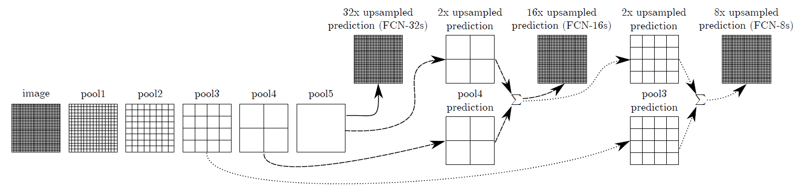
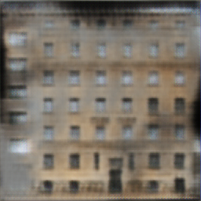

# Assignment 2 - Pix2Pix

本次实验的第二个部分要求用FCN网络实现Pix2Pix。

## 环境配置
本次实验使用解释器python3.10，以及库opencv-python 4.10.0.84, numpy 1.26.4, torch2.4.1, matplotlib3.9.2

## 模型训练
```basic
python train.py
```

## 模型使用
最终的网络参数已训练完成，通过运行test.py可对指定图片进行测试。
```basic
python test.py path/to/your/test_image.jpg path/to/save/output_image.jpg
```
在终端运行该脚本时，需要传入两个参数，分别为输入图片的路径和输出图片的保存路径。
请确保将路径 path/to/your/test_image.jpg 和 path/to/save/output_image.jpg 替换为实际的文件路径。

---
## 网络参数与结构的调整过程
### FCN-8s(Net1)
首次尝试使用论文中提到的FCN-8s网络(相比其他网络效果更好)。

在此网络架构中，第一次卷积将3通道图像变为32通道并将大小缩减为原图像的1/2，随后依次经过4个卷积层得到图像大小分别为原图像的1/4,
1/8,1/16,1/32。再加两个卷积层(相当于CNN中全连接层的作用)得到512通道，大小为1/32的heatmap。

原论文中，直接将heatmap上采样即得到FCN-32s；将heatmap上采样2倍并跳跃连接与1/16大小的图像结合再上采样得到FCN-16s；
将上述与1/16图像结合的结果上采样2倍再与1/8图像结合再上采样得到FCN-8s。理论上还有FCN-4s,FCN-2s,但作者表明FCN-8s效果最好，
增加更多的跳跃连接不会带来提升。


此网络训练完成后，训练集误差很小，大约在1e-2至1e-3，然而验证集误差却维持在0.3以上。
出现这种情况的原因是过拟合，网络设置卷积层和参数很多，学习能力很强，而数据集却只有几百张图片，导致了过拟合，下面展示了此网络的训练集及验证集结果：


---
出现上述情况的另一个可能的原因是数据集的问题，训练数据中可能存在部分噪声比较大的数据，需要删去个别影响大的数据以保证模型收敛。
比如下面的数据明显噪声和误差很大：


另一方面可以通过opencv给数据做一些随机的旋转、缩放、翻转来实现数据增强来缓和过拟合现象，见[data_augumentation.py](Pix2Pix/data_augumentation.py)。
(**此脚本不必运行，datasets中的数据已经经过预处理**)


### FCN-8s(net2)
由上面的结果发现网络的结构不能太简单也不能太复杂，针对同一个数据集，如何平衡好过拟合与欠拟合的问题十分重要。
经过多次尝试与参数调整后，最终设置的FCN-8s结构见[FCN_network.py](Pix2Pix/FCN_network.py)。

另外还添加了脚本[plot_loss.py](Pix2Pix/plot_loss.py)用于绘制loss曲线。


从结果来看可能是学习率设置不合理导致收敛时仍有一定误差，可以调整学习率并以之前训练的权重为初始化权重继续训练，但是需要小心过拟合。

模型的训练权重已经保存在Pix2Pix文件夹中，通过test.py可以对给定的图片进行测试。
下面是测试结果：




---
## 总结与不足
从网络结构和调整过程来看，主要出现了以下问题：

1.输出层的激活函数选择不当导致训练loss或验证loss不收敛。

2.网络层数及通道数选择不当导致参数过多或过少，出现过拟合或欠拟合的现象。可以适当调整网络结构并引入正则项权重衰减。

3.训练误差或验证误差出现振荡或不下降的情况，需要适当调整batchsize或学习率以平衡振动和收敛缓慢的问题。

4.数据集太小或者存在一些“不好”的数据影响收敛，需要进行数据清洗及数据增强。

本次实验的一些不足之处：

没有使用更多的数据集来提高模型的泛化能力。其中主要是本人的设备性能有限，训练一次网络时间较长，再加上其它数据集占用内存很大(cityscapes 56GB)，故没有做更进一步的尝试。

最后一点点感悟：本次作业是本人第一次接触pytorch训练神经网络，训练模型调参数是一个费时费力的过程，需要积累很多经验才能少走弯路，
这次作业让我受益匪浅，收获了很多有关机器学习的知识和实践技巧。

## Reference and Acknowledgement
>📋 Thanks for the algorithms proposed by [Paper: Image-to-Image Translation with Conditional Adversarial Nets](https://phillipi.github.io/pix2pix/)
> 
>   [Paper: Fully Convolutional Networks for Semantic Segmentation](https://arxiv.org/abs/1411.4038)

> 其他参考资料：DIP课程课件，Pytorch相关教程
> 
> [知乎相关文章1](https://zhuanlan.zhihu.com/p/401217834)
> 
> [知乎相关文章2](https://zhuanlan.zhihu.com/p/285601835)
> 
> [知乎相关文章3](https://zhuanlan.zhihu.com/p/622943295)
> 
> （包括如何处理欠拟合、过拟合等问题）

> 最后感谢Github copilot和gpt-4o对本次作业提供的指导与帮助
