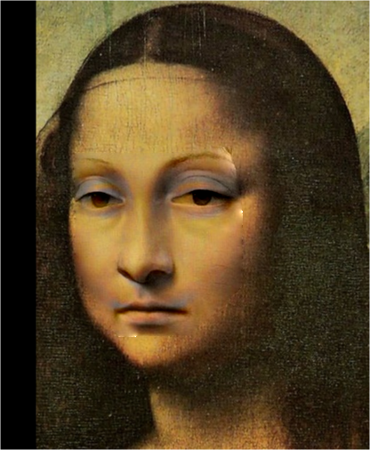

# Assignment 2 - Poisson Image Editing

本次实验的第一个部分要求实现Poisson图像编辑([Paper: Poisson Image Editing](https://www.cs.jhu.edu/~misha/Fall07/Papers/Perez03.pdf))

## 环境配置
本次实验使用解释器python3.10，以及库opencv-python 4.10.0.84, numpy 1.26.4, gradio 3.36.1, torch2.4.1

## 程序运行与使用
```basic
python run_blending_gradio.py
```

## 1.  具体实现

首先需要获取指定多边形区域的mask，理论上应该使用多边形扫描线算法获取多边形区域内部的信息。然而手动实现多边形扫描线算法效率
较低，因此可直接使用opencv的fillPoly函数:

```python
mask = cv2.fillPoly(mask, [points], (255, 255, 255))
```

然后需要利用pytorch计算损失函数：Laplacian梯度。直接对mask区域用Laplacian卷积核作用即可，这里卷积核有两种选择：

$$
\begin{pmatrix}
0 & 1 & 0 \\
1 & -4 & 1 \\
0 & 1 & 0
\end{pmatrix}
$$

$$
\begin{pmatrix}
1 & 1 & 1 \\
1 & -8 & 1 \\
1 & 1 & 1
\end{pmatrix}
$$

这里选取了后者：
```python
Filter = torch.tensor([[1, 1, 1], [1, -8, 1], [1, 1, 1]], dtype=torch.float32, device=foreground_img.device).view(1, 1, 3, 3).repeat(1, 3, 1, 1)
Laplacian_foreground = torch.nn.functional.conv2d(foreground_img, Filter, padding=1) * foreground_mask
Laplacian_blended = torch.nn.functional.conv2d(blended_img, Filter, padding=1) * background_mask
```

这里不仅实现了Poisson图像编辑，还实现了文章里提到的混合梯度Poisson图像编辑以更好适应背景纹理。实现混合梯度的Poisson图像编辑只需要在计算梯度时做一次比较，
如果背景图像的Laplacian梯度更大，则取对应背景图像像素点的梯度。

```python
rect_foreground = get_rect_mask(foreground_polygon_points)
rect_background = get_rect_mask(background_polygon_points)
Laplacian_foreground = Laplacian_foreground[:, :, rect_foreground[0][1]:rect_foreground[1][1], rect_foreground[0][0]:rect_foreground[1][0]]
Laplacian_blended = Laplacian_blended[:, :, rect_background[0][1]:rect_background[1][1], rect_background[0][0]:rect_background[1][0]]
if mixed_gradient == "Mixed Gradients":
    Laplacian_background = torch.nn.functional.conv2d(background_img, Filter, padding=1) * background_mask
    Laplacian_background = Laplacian_background[:, :, rect_background[0][1]:rect_background[1][1], rect_background[0][0]:rect_background[1][0]]
    mixed_flag = torch.abs(Laplacian_background).gt(torch.abs(Laplacian_foreground)).float()
    Laplacian_mixed = mixed_flag * Laplacian_background + (1 - mixed_flag) * Laplacian_foreground
    loss = torch.mean((Laplacian_mixed - Laplacian_blended) ** 2)
else:
    loss = torch.mean((Laplacian_foreground - Laplacian_blended) ** 2)
```

## 2.  结果展示（Poisson与Mixed Poisson）





## 3.  总结
从结果来看，Poisson图像编辑能较好实现两种图像的融合，而混合梯度的Poisson编辑则能更好地保持原背景图像的纹理。
以蒙娜丽莎为例，下面的混合梯度poisson图像编辑保持了微笑表情，而上面的Poisson编辑则是继承了前景图像中的悲伤表情。

## Reference and Acknowledgement
>📋 Thanks for the algorithms proposed by [Paper: Poisson Image Editing](https://www.cs.jhu.edu/~misha/Fall07/Papers/Perez03.pdf).

> 其他参考资料：DIP课程课件，Pytorch,opencv相关教程