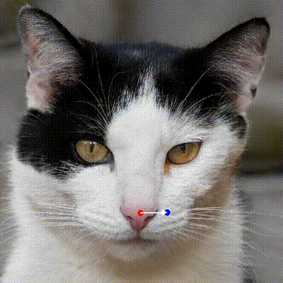
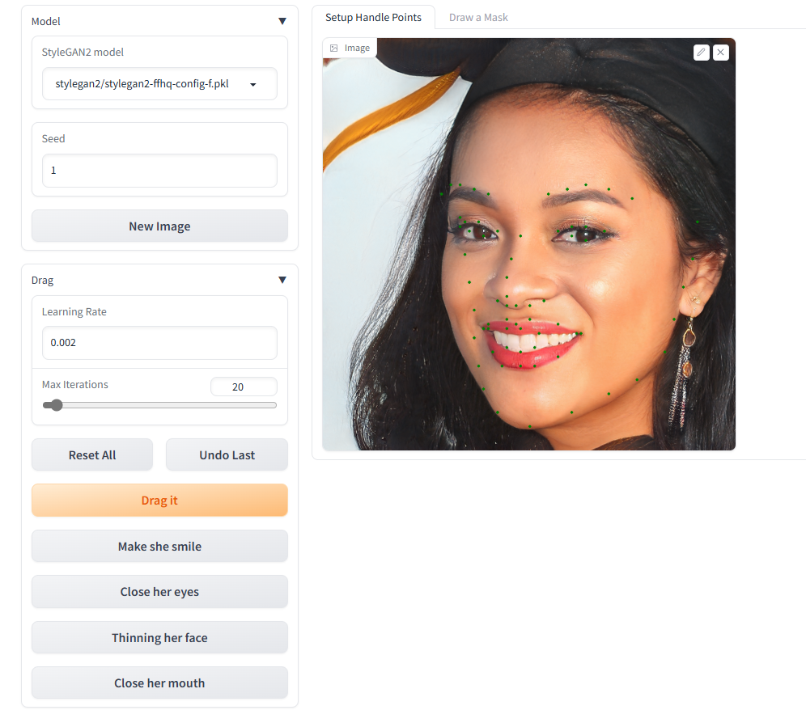

# Assignment 3 - DragGAN with Face Alignment

本次实验的第二个部分是将[DragGAN](https://github.com/OpenGVLab/DragGAN)
和[Face Alignment](https://github.com/1adrianb/face-alignment) 结合起来。

## 环境配置
**环境配置部分需要格外小心！！！**

经过本人多次尝试与debug，发现Draggan的配置***只能是cuda11.7+visual studio 2019+Miniconda。***

安装完cuda11.7和vs 2019后创建新环境并执行如下操作：
```basic
conda create -n draggan python=3.7

conda install pytorch torchvision torchaudio pytorch-cuda=11.7 -c pytorch -c nvidia

pip install draggan

conda install -c 1adrianb face_alignment
```
具体配置操作见[DragGAN](https://github.com/OpenGVLab/DragGAN) 。

配置完成后可以运行[test_facealignment.py](DragGANwithFace-Alignment/test_facealignment.py)可以测试face_alignment是否配置成功，
测试结果如下：


在终端执行：
```basic
python -m draggan.web
```
以测试DragGAN是否配置成功，以下是DragGAN的单独测试示例：




高清的MP4视频见 [video1](figures/dt1.mp4) [video2](figures/dt2.mp4)


---
## DragGAN + Face Alignment
本人对Draggan的web.py做了简单的修改，使得gradio交互界面可以显示face alignment的结果并且可以基于这些点选取控制点，
具体方法是当鼠标选取点接近face alignment结果时，自动选取这些点，然后再指定目标点。

运行[web.py](DragGANwithFace-Alignment/web.py) 并进入交互界面，即可选取点并调整迭代次数、学习率等参数，
再点击Drag it即可得到结果，下面是运行结果展示：

程序默认界面展示：



选取点展示：


运行结果展示：


高清的MP4结果见[dwf1.mp4](figures/dwf1.mp4) 。

另外即使目前原版的Draggan在运行之后也会有无法上传自定义图片的bug，因此暂时没有尝试更多的结果。


---
## 总结与不足

本次实验的第二部分通过对两个开源项目的配置和组合（配置环境占用了90%的时间），锻炼了我调用开源库和配置项目的能力，
同时这次实验能让我们体验到图像处理一些先进的技术。

从结果来看，face alignment和Draggan都能分别很好地运行，将它们组合后可以将face alignment的结果作为Draggan
的输入指导目标点的选取。

当然本次实验仅仅是将两个项目简单组合在一起，并没有考虑更深层次的结合和应用，也存在一些缺陷和不足之处。

## Reference and Acknowledgement
>📋 感谢[Drag Your GAN: Interactive Point-based Manipulation on the Generative Image Manifold](https://github.com/OpenGVLab/DragGAN)
> 以及[Face Alignment](https://github.com/1adrianb/face-alignment)
> 提供开源项目

> 其他参考资料：DIP课程课件，Pytorch相关教程

> 感谢Github copilot和gpt-4o对本次作业提供的指导与帮助


