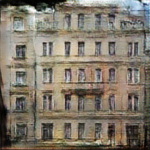

# Assignment 3 - Pix2Pix With GAN

本次实验的第一个部分是利用GAN来提升FCN实现Pix2Pix的效果。

## 环境配置
本次实验使用解释器python3.10，以及库opencv-python 4.10.0.84, numpy 1.26.4, torch2.4.1, matplotlib3.9.2

## 模型训练
```basic
python train.py
```

## 模型使用
最终的网络参数已训练完成，通过运行test.py可对指定图片进行测试。（预训练权重较大暂时没有push到github上，所以可能测试不了，可以看下面的部分结果，后续可能会上传）
```basic
python test.py path/to/your/test_image.jpg path/to/save/output_image.jpg
```
在终端运行该脚本时，需要传入两个参数，分别为输入图片的路径和输出图片的保存路径。
请确保将路径 path/to/your/test_image.jpg 和 path/to/save/output_image.jpg 替换为实际的文件路径。

---
## 网络结构设计
训练GAN网络需要判别器(discriminator)和生成器(generator)两个网络。

生成器以语义图为输入，类似FCN进行上采样和下采样并增加跳跃连接，
并输出生成的图片，详见[GAN_network.py](./GAN_network.py)。

判别器以语义图和真实图片或生成器的输出为输入，输出为1通道的矩阵，表示输入的真实性。

关于**损失函数**，我们参考论文Image-to-Image Translation with Conditional Adversarial Networks中的设计，为了训练条件GAN，
对于生成器，我们使用了L1损失和GAN损失（论文指出L1损失项系数为100比较合适，这里发现取10效果也很好），对于判别器，我们使用了GAN损失：

  


参数设置如下，这里采用了论文中的学习率和betas参数。
```python
criterion_GAN = nn.BCEWithLogitsLoss()
criterion_L1 = nn.L1Loss()
optimizer_g = optim.Adam(generator.parameters(), lr=0.0002, betas=(0.5, 0.999))
optimizer_d = optim.Adam(discriminator.parameters(), lr=0.0002, betas=(0.5, 0.999))

scheduler_g = StepLR(optimizer_g, step_size=50, gamma=0.2)
scheduler_d = StepLR(optimizer_d, step_size=50, gamma=0.2)
```

交替训练生成器和判别器，损失的曲线如下：


训练结果如下：


测试结果如下：




在更大的数据集cityscapes上的结果：

loss曲线：


训练结果：


测试结果：

 
 


可见效果确实比FCN要好很多，生成的图片更加真实，相对没那么模糊。

---
## 总结与不足
本次实验结果相比FCN有了很大改进，但是与论文结果还是有一定差距，很可能是由于网络结构或参数调整不当导致的偏差，后续有改进的空间。

## Reference and Acknowledgement
>📋 Thanks for the algorithms proposed by [Paper: Image-to-Image Translation with Conditional Adversarial Nets](https://phillipi.github.io/pix2pix/)

> 其他参考资料：DIP课程课件，Pytorch相关教程

> 感谢Github copilot和gpt-4o对本次作业提供的指导与帮助


