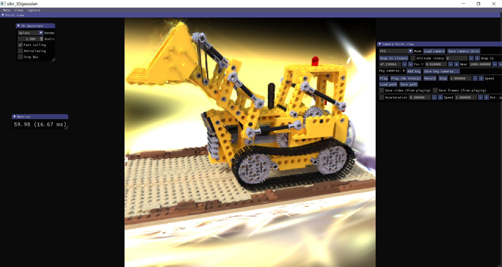

# Assignment 4 - Simplified 3D Gaussian 

本次实验需要实现一个简化版本的3DGS，并与原版的3DGS  [original 3DGS implementation](https://github.com/graphdeco-inria/gaussian-splatting) 进行对比。

## 环境配置
cuda 11.8 + torch 2.4.1 + Visual Studio 2019 + Colmap 3.10 + cub 2.1.0

```
conda install --yes --file requirements.txt
```
详见3DGS项目配置：[3D Gaussian Splatting](https://github.com/graphdeco-inria/gaussian-splatting)

---
## 具体实现+细节补充

1.计算三维协方差矩阵： 

$ \boldsymbol{\Sigma} = RSS^{T}R^{T} $ 

```python
# Convert scales from log space and create diagonal matrices
scales = torch.exp(self.scales)
scales = scales ** 2
S = torch.diag_embed(scales)
        
# Compute covariance
Covs3d = torch.matmul(torch.matmul(R, S), R.transpose(-1, -2))  # (N, 3, 3)
```

2.计算投影变换的Jacobian矩阵： 由透视投影关系： $ x' = f_x\frac{x}{z}, y' = f_y\frac{y}{z} $，计算可得Jacobian矩阵：

$$
    \begin{pmatrix}
        \frac{f_x}{z} & 0 & -\frac{f_x x}{z^2} \\
        0 & \frac{f_y}{z} & -\frac{f_y y}{z^2}
    \end{pmatrix}
$$

```python
J_proj[:, 0, 0] = K[0, 0] / depths
J_proj[:, 0, 2] = -cam_points[:, 0] * K[0, 0] / depths / depths
J_proj[:, 1, 1] = K[1, 1] / depths
J_proj[:, 1, 2] = -cam_points[:, 1] * K[1, 1] / depths / depths
```

3.计算2D协方差矩阵： 

$ \boldsymbol{\Sigma}' = JW \boldsymbol{\Sigma} W^{T} J^{T} $

```python
# Transform covariance to camera space
covs_cam = torch.matmul(R.unsqueeze(0), torch.matmul(covs3d, R.unsqueeze(0).transpose(-1, -2)))  # (N, 3, 3)
# Project to 2D
covs2D = torch.matmul(J_proj, torch.matmul(covs_cam, J_proj.transpose(-1, -2)))  # (N, 2, 2)
```

4.计算Gaussian函数的值：

$$
  f(\mathbf{x}; \boldsymbol{\mu}\_{i}, \boldsymbol{\Sigma}\_{i}) = \frac{1}{2 \pi \sqrt{ | \boldsymbol{\Sigma}\_{i} |}} \exp \left ( {-\frac{1}{2}} (\mathbf{x} - \boldsymbol{\mu}\_{i})^T \boldsymbol{\Sigma}\_{i}^{-1} (\mathbf{x} - \boldsymbol{\mu}\_{i}) \right ) = \frac{1}{2 \pi \sqrt{ | \boldsymbol{\Sigma}\_{i} |}} \exp \left ( P_{(\mathbf{x}, i)} \right )
$$

```python
# Compute determinant for normalization
det_covs2D = torch.det(covs2D).view(N, 1, 1)
# Compute inverse of covariance matrices
inv_covs2D = torch.inverse(covs2D)
# Compute Gaussian values
exponent = -0.5 * torch.einsum('nhwi, nij, nhwj -> nhw', dx, inv_covs2D, dx)
gaussian = torch.exp(exponent) / (2 * np.pi * torch.sqrt(det_covs2D))
```

5.体渲染：α-blending

$$
  \alpha_{(\mathbf{x}, i)} = o_i*f(\mathbf{x}; \boldsymbol{\mu}\_{i}, \boldsymbol{\Sigma}\_{i})
$$

$$
  T_{(\mathbf{x}, i)} = \prod_{j \lt i} (1 - \alpha_{(\mathbf{x}, j)})
$$

最终像素的颜色为：

$$
  C = \sum_{i=1}^{N} T_{i} \boldsymbol{\alpha}_{i} c_{i}
$$

```python
# 7. Compute weights
weights = alphas * (1 - alphas).cumprod(dim=0) # (N, H, W)
# 8. Final rendering
rendered = (weights.unsqueeze(-1) * colors).sum(dim=0) # (H, W, 3)
```

---

## 结果展示

由于设备或实现方式等原因，一次epoch训练需要20分钟左右，完成全部200个epoch训练太耗时，效率很低，因此只进行到了30次。

初始投影结果：


训练0 epochs结果：


训练15 epochs结果：


训练30 epochs结果：


## 原版3DGS实现效果

原版3dgs训练效率很高，大概30多分钟就能完成所有的训练，下面是效果展示：


可以看到原版3DGS效果非常好，而且效率也非常高。

对于另一个例子lego，大约15分钟就能完成训练，结果如下：




## 总结与不足

本次实验让我对3DGS有了更深入的理解和认识，虽然实现的简化版本3DGS效果与原版3DGS还是有较大差距（无论是效率还是效果上），
但是还是能从具体的实践过程中学习到很多东西。


## Reference and Acknowledgement
>📋 感谢[3DGS paper](https://repo-sam.inria.fr/fungraph/3d-gaussian-splatting/3d_gaussian_splatting_low.pdf)
>提供模型及实现细节，以及
>[3D Gaussian Splatting](https://github.com/graphdeco-inria/gaussian-splatting)
> 提供开源项目

> 其他参考资料：DIP课程课件，Pytorch相关教程

> 感谢Github copilot和gpt-4o对本次作业提供的指导与帮助


